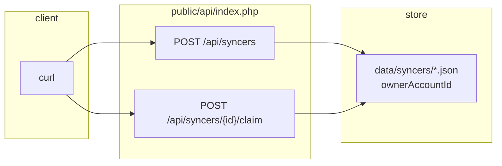
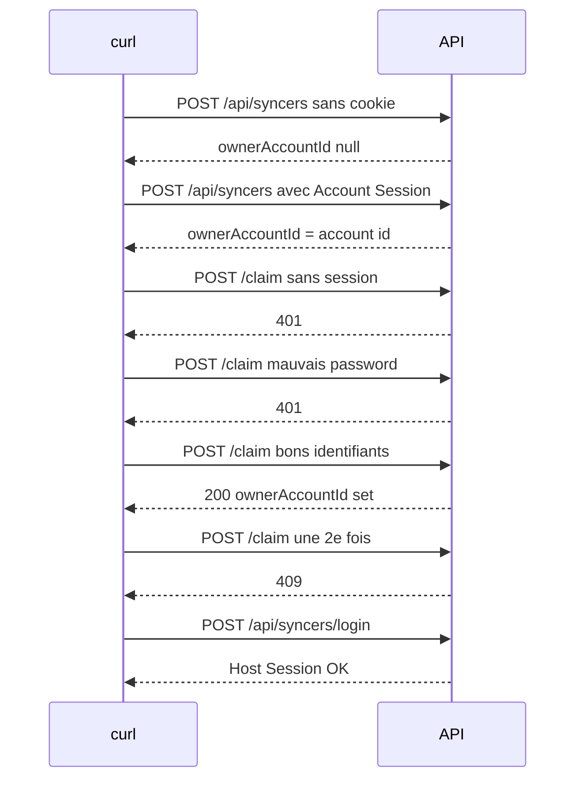

# Ticket 002 — implémenté et vérifié

Ticket : [`../SyncMates/docs/agents/tickets/002-ownership-at-creation-and-claim.md`](../SyncMates/docs/agents/tickets/002-ownership-at-creation-and-claim.md)

**Verdict :** les critères d’acceptation du ticket sont **tous verts** après tests HTTP réels (10 September 2026). Session agent **neuve** (`claude -p` **uniquement** 002, prompt : [`prompts/002-implement.txt`](prompts/002-implement.txt)).

---

## Ce que 002 doit faire

Ownership à la création (session Account) **ou** Claim d’un Free Syncer (session Account **+** identifiants Host).

---

## Comment on a testé

Serveur : `php -S 127.0.0.1:8092 public/dev-router.php` (CLI PHP, pas Apache).  
Script : `Autonomy_1/scripts/verify-002.sh`.

---

## Résultats (copie des réponses réelles)

| # | Appel | Attendu (ticket) | Observé |
|---|---|---|---|
| 1 | `POST /api/syncers` anonyme | `ownerAccountId: null` | HTTP 201 — `{"message":"Syncer créé.","syncer":{"id":"sync_e5a7def2a5ca450d","name":"Anon002-1789037355","host":{"name":"Host"},"participants":[],"eventStartDate":null,"eventEndDate":null,"createdAt":"2026-09-10T10:49:15+00:00","expiresAt":"2026-09-12T10:49:15+00:00","shareToken":"bcaf15df4b0801d6ba3593aa910256d8aa3e10cf6a881a7c","ownerAccountId":null,"status":"active"}}` |
| 2 | `POST /api/syncers` + cookie Account | `ownerAccountId` = id du compte | HTTP 201 — `{"message":"Syncer créé.","syncer":{"id":"sync_2c52de17c0b76eff","name":"Owned002-1789037355","host":{"name":"Host"},"participants":[],"eventStartDate":null,"eventEndDate":null,"createdAt":"2026-09-10T10:49:16+00:00","expiresAt":"2026-09-12T10:49:16+00:00","shareToken":"1735a058ae30b800c769f52f462c5e67a9ac55659ebd8e94","ownerAccountId":"acct_c1d680ddb5d309cc","status":"active"}}` |
| 3 | `POST /claim` sans session | 401 | HTTP 401 — `{"error":"Authentification Account requise."}` |
| 4 | `POST /claim` mauvais password Host | 401, owner inchangé | HTTP 401 — `{"error":"Identifiants de connexion invalides."}` |
| 5 | `POST /claim` session + bons identifiants | owner set | HTTP 200 — `{"message":"Syncer réclamé.","syncer":{"id":"sync_b79272577f964386","name":"ClaimMe002-1789037355","host":{"name":"Host"},"participants":[],"eventStartDate":null,"eventEndDate":null,"createdAt":"2026-09-10T10:49:16+00:00","expiresAt":"2026-09-12T10:49:16+00:00","shareToken":"b8854906b2e0f67d9f3ce6d14ebad2065484aa83f20bfb83","ownerAccountId":"acct_c1d680ddb5d309cc","status":"active"}}` |
| 6 | 2e claim | 409 | HTTP 409 — `{"error":"Ce Syncer appartient déjà à un Account."}` |
| 7 | `POST /api/syncers/login` après claim | Host login intact | HTTP 200 — `{"message":"Connexion réussie.","syncer":{"id":"sync_b79272577f964386","name":"ClaimMe002-1789037355","host":{"name":"Host"},"participants":[],"eventStartDate":null,"eventEndDate":null,"createdAt":"2026-09-10T10:49:16+00:00","expiresAt":"2026-09-12T10:49:16+00:00","shareToken":"b8854906b2e0f67d9f3ce6d14ebad2065484aa83f20bfb83","ownerAccountId":"acct_c1d680ddb5d309cc","status":"active"}}` |
