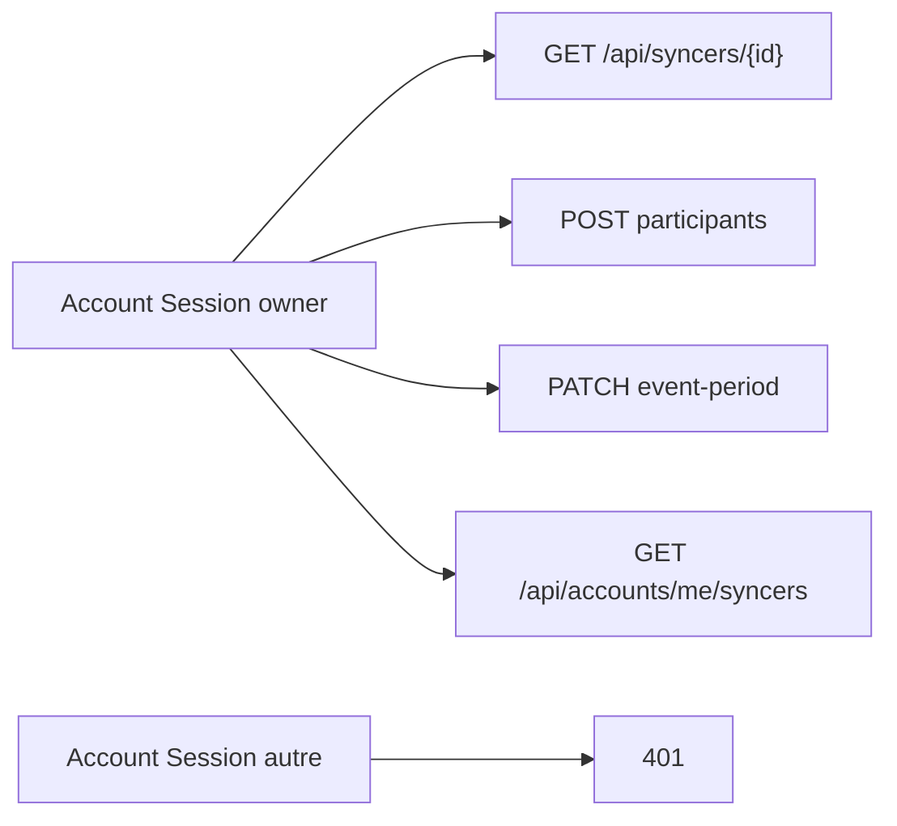

# Ticket 003 — implémenté et vérifié

Ticket : [`../SyncMates/docs/agents/tickets/003-account-session-manages-owned-syncers.md`](../SyncMates/docs/agents/tickets/003-account-session-manages-owned-syncers.md)

**Verdict :** les critères d’acceptation du ticket sont **tous verts** après tests HTTP réels (10 September 2026). Session agent **neuve** (`claude -p` **uniquement** 003, prompt : [`prompts/003-implement.txt`](prompts/003-implement.txt)).

---

## Ce que 003 doit faire

Gérer un Syncer **owned** avec **seulement** l’Account Session, et lister `GET /api/accounts/me/syncers`.

---

## Comment on a testé

Serveur : `php -S 127.0.0.1:8093 public/dev-router.php`.  
Script : `Autonomy_1/scripts/verify-003.sh`.

---

## Résultats (copie des réponses réelles)

| # | Appel | Attendu (ticket) | Observé |
|---|---|---|---|
| 1 | GET détails + cookie owner (pas de Host) | succès | HTTP 200 — `{"syncer":{"id":"sync_56f58e2239dc8edd","name":"S003-1789037357","host":{"name":"Host"},"participants":[],"eventStartDate":null,"eventEndDate":null,"createdAt":"2026-09-10T10:49:18+00:00","expiresAt":"2026-09-12T10:49:18+00:00","shareToken":"ba3ad0e0388290c0e2bc73086f5b5cf411b28647937abc57","ownerAccountId":"acct_2b4ae10529713154","status":"active"}}` |
| 2 | POST participant + cookie owner | succès | HTTP 200 — `{"message":"Participant ajouté.","syncer":{"id":"sync_56f58e2239dc8edd","name":"S003-1789037357","host":{"name":"Host"},"participants":[{"id":"p_d06bbd8083dc","name":"Alice","unavailableDates":[]}],"eventStartDate":null,"eventEndDate":null,"createdAt":"2026-09-10T10:49:18+00:00","expiresAt":"2026-09-12T10:49:18+00:00","shareToken":"ba3ad0e0388290c0e2bc73086f5b5cf411b28647937abc57","ownerAccountId":"acct_2b4ae10529713154","status":"active"}}` |
| 3 | PATCH event-period + cookie owner | succès | HTTP 200 — `{"message":"Période de l'évènement configurée.","syncer":{"id":"sync_56f58e2239dc8edd","name":"S003-1789037357","host":{"name":"Host"},"participants":[{"id":"p_d06bbd8083dc","name":"Alice","unavailableDates":[]}],"eventStartDate":"2026-09-15","eventEndDate":"2026-09-20","createdAt":"2026-09-10T10:49:18+00:00","expiresAt":"2026-09-12T10:49:18+00:00","shareToken":"ba3ad0e0388290c0e2bc73086f5b5cf411b28647937abc57","ownerAccountId":"acct_2b4ae10529713154","status":"active"}}` |
| 4 | DELETE participant + cookie owner | succès | HTTP 200 — `{"message":"Participant supprimé.","syncer":{"id":"sync_56f58e2239dc8edd","name":"S003-1789037357","host":{"name":"Host"},"participants":[],"eventStartDate":"2026-09-15","eventEndDate":"2026-09-20","createdAt":"2026-09-10T10:49:18+00:00","expiresAt":"2026-09-12T10:49:18+00:00","shareToken":"ba3ad0e0388290c0e2bc73086f5b5cf411b28647937abc57","ownerAccountId":"acct_2b4ae10529713154","status":"active"}}` |
| 5 | GET détails + cookie **autre** Account | rejeté | HTTP 401 — `{"error":"Authentification host requise."}` |
| 6 | GET détails **sans** session | rejeté comme avant | HTTP 401 — `{"error":"Authentification host requise."}` |
| 7 | GET /api/accounts/me/syncers owner | le Syncer owned | HTTP 200 — `{"syncers":[{"id":"sync_56f58e2239dc8edd","name":"S003-1789037357","host":{"name":"Host"},"participants":[],"eventStartDate":"2026-09-15","eventEndDate":"2026-09-20","createdAt":"2026-09-10T10:49:18+00:00","expiresAt":"2026-09-12T10:49:18+00:00","shareToken":"ba3ad0e0388290c0e2bc73086f5b5cf411b28647937abc57","ownerAccountId":"acct_2b4ae10529713154","status":"active"}]}` |
| 8 | GET /api/accounts/me/syncers autre | liste vide (pas le Syncer de A) | HTTP 200 — `{"syncers":[]}` |
| 9 | Host Session sur Syncer `ownerAccountId: null` | inchangé | HTTP 200 — `{"syncer":{"id":"sync_4dbe43dcd3d757d4","name":"Free003-1789037357","host":{"name":"Host"},"participants":[],"eventStartDate":null,"eventEndDate":null,"createdAt":"2026-09-10T10:49:19+00:00","expiresAt":"2026-09-12T10:49:19+00:00","shareToken":"8821339d72ff9c3096b1e7914c4989e07a5854aebd7eb0d8","ownerAccountId":null,"status":"active"}}` |
