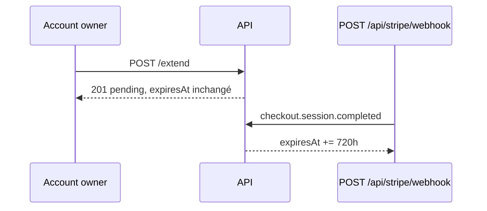

# Ticket 004 — implémenté et vérifié

Ticket : [`../SyncMates/docs/agents/tickets/004-paid-syncer-extension-via-stripe.md`](../SyncMates/docs/agents/tickets/004-paid-syncer-extension-via-stripe.md)

**Verdict :** les critères d’acceptation du ticket sont **tous verts** après tests HTTP réels (10 September 2026). Stripe : **API Stripe test (session réelle), Checkout 100 eur**. Prix attendu : **1 €** (100 cents, `eur`). Confirmation lab = webhook simulé (Stripe ne joint pas localhost). Clés dans `config/stripe.local.php` (gitignoré).

---

## Ce que 004 doit faire

Extension one-off : initier Checkout **sans** bouger `expiresAt`, puis webhook → cumul de 720 h.

---

## Comment on a testé

Serveur : `php -S 127.0.0.1:8094 public/dev-router.php`.  
Script : `Autonomy_1/scripts/verify-004.sh`.

---

## Résultats (copie des réponses réelles)

| # | Appel | Attendu (ticket) | Observé |
|---|---|---|---|
| 1 | POST /extend Syncer anonyme | rejeté avant Stripe (409) | HTTP 409 — `{"error":"Ce Syncer n'est pas possédé par un Account: il doit d'abord être Claim avant de pouvoir être étendu."}` |
| 2 | POST /extend autre Account | rejeté (403) | HTTP 403 — `{"error":"Ce Syncer appartient à un autre Account."}` |
| 3 | POST /extend sans session | 401 | HTTP 401 — `{"error":"Authentification Account requise."}` |
| 4 | POST /extend owner | 201, expiresAt inchangé, Checkout **1 €** | HTTP 201 — prix=`100 eur` cs=`cs_test_a172FNKQEDFHJrLZx2l0y8SqMze43JQUYOucB6L3qHqWQfnrcvtwVkkNMW` url=`https://checkout.stripe.com/c/pay/cs_test_a172FNKQEDFHJrLZx2l0y8SqMze43JQUYOucB6L3qHqWQfnrcvtwVkkNMW#fidnandhYHdWcXxpYCc%2FJ2FgY2RwaXEnKSdicGRmZGhqaWBTZHdsZGtxJz8nZmprcXdqaScpJ2R1bE5gfCc%2FJ3VuWnFgdnFaMDRQQDBJU09Pd1dHYm5CXTJPbXZmMHxtf2Nyc1NcUktudDNkRkRWZ0A3b2JRXXRfZ2ZLPEM0UUE3YkNnczRUTWNIPFxSM2pUT0JnRjdoNW9WcTI2NTNJXEg1NVBsPTx2Q0lnJyknY3dqaFZgd3Ngdyc%2FcXdwYCknZ2RmbmJ3anBrYUZqaWp3Jz8nJmNjY2NjYycpJ2lkfGpwcVF8dWAnPyd2bGtiaWBabHFgaCcpJ2BrZGdpYFVpZGZgbWppYWB3dic%2FcXdwYHgl` expiresAt=`2026-09-12T10:49:21+00:00` |
| 5 | webhook 1 | expiresAt + 720h | HTTP 200 — `2026-10-12T10:49:21+00:00` |
| 6 | webhook 2 (cumul) | encore + 720h | HTTP 200 — `2026-11-11T10:49:21+00:00` |
| 7 | 3e /extend **sans** webhook | expiresAt inchangé (`2026-11-11T10:49:21+00:00`) | HTTP 201 — expiresAt `2026-11-11T10:49:21+00:00` |

expiresAt initial : `2026-09-12T10:49:21+00:00`

## Paiement carte test (hors script curl)

PaymentIntent **`pi_3UE5eMJJrRBgkGX71OVfUZyu`** : **1,00 EUR**, `succeeded`, carte test Visa Stripe (`pm_card_visa` = 4242…). Dashboard Test → Paiements.

