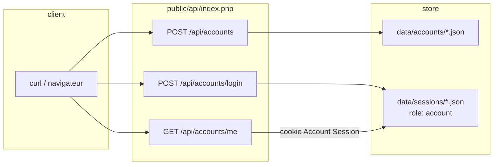
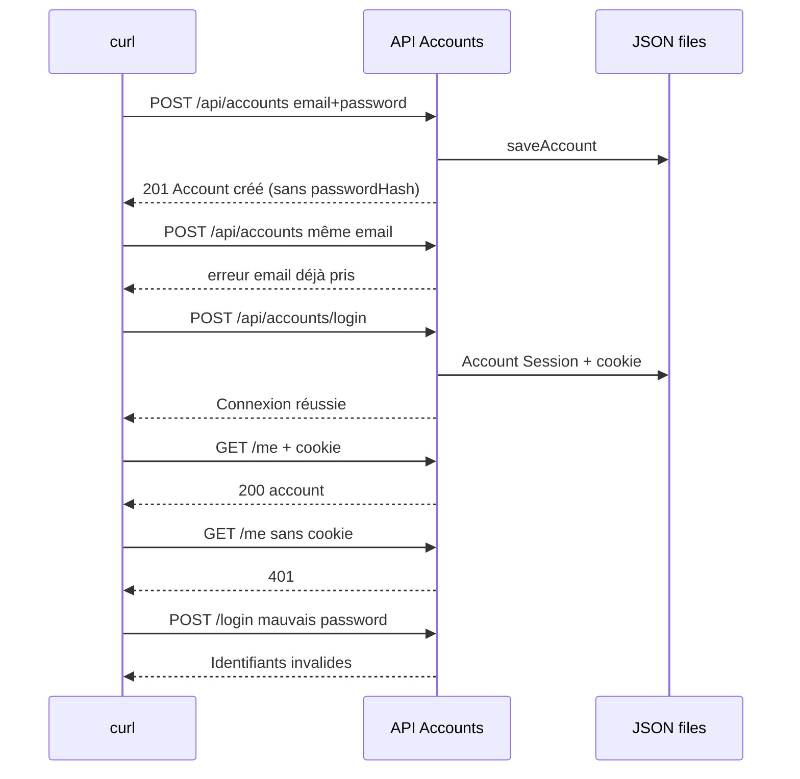

# Ticket 001 — implémenté et vérifié

Ticket : [`../SyncMates/docs/agents/tickets/001-account-registration-and-session.md`](../SyncMates/docs/agents/tickets/001-account-registration-and-session.md)

**Verdict :** les critères d’acceptation du ticket sont **tous verts** après tests HTTP réels (10 septembre 2026). Session agent **neuve** (`/clear` + `/implement` **uniquement** 001). L’agent n’a pas demandé de contexte hors ticket.

---

## Ce que 001 doit faire

Une *unit of work* **sans Syncer** : Account JSON → service → routes HTTP.

---

## Comment on a testé

Serveur : `php -S localhost:8080 public/dev-router.php` (CLI PHP 8.4, pas Apache).  
Client : `curl` dans **un autre** terminal.

---

## Résultats (copie des réponses réelles)

| # | Appel | Attendu (ticket) | Observé |
|---|---|---|---|
| 1 | `POST /api/accounts` | 201, compte sans hash | `HTTP/1.1 201 Created` — `{"message":"Account créé.","account":{"id":"acct_345b258041f15c8f","email":"test@example.com","createdAt":"..."}}` — **pas** de `passwordHash` |
| 2 | Même email une 2ᵉ fois | rejet unicité | `{"error":"Un Account avec cet email existe déjà."}` |
| 3 | `POST /api/accounts/login` bons identifiants | session + cookie | `{"message":"Connexion réussie.","account":{... même id ...}}` |
| 4 | `GET /api/accounts/me` **avec** cookie | le compte | `{"account":{"id":"acct_345b258041f15c8f","email":"test@example.com",...}}` |
| 5 | `GET /api/accounts/me` **sans** cookie | 401 | `401` |
| 6 | Login mot de passe faux | échec | `{"error":"Identifiants de connexion invalides."}` |
---
