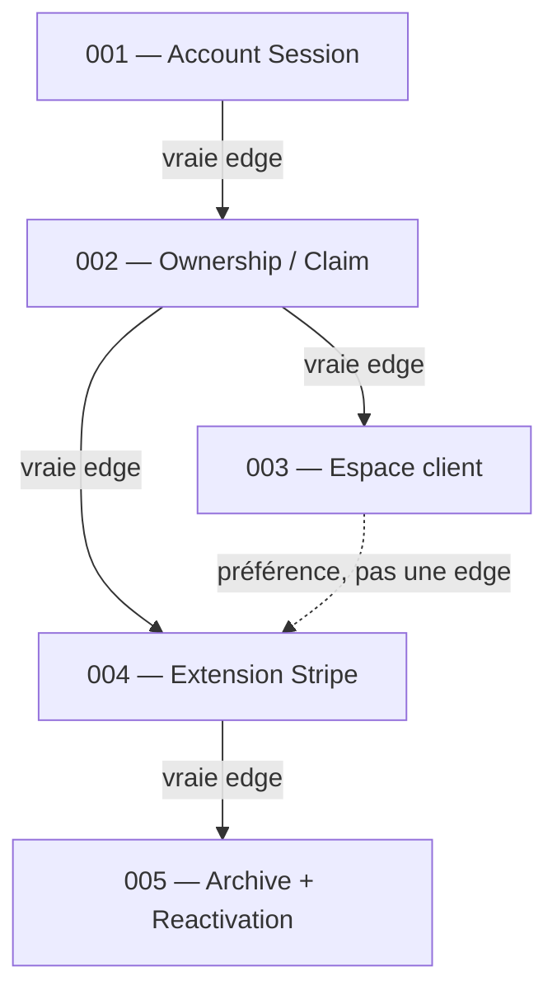

# Lab 1 — units of work, tickets, edges

Les tickets complets : [`../SyncMates/docs/agents/tickets/`](../SyncMates/docs/agents/tickets/).

---

## Les 5 units (une ligne chacune)

| Ticket | Unit of work |
|---|---|
| [001](../SyncMates/docs/agents/tickets/001-account-registration-and-session.md) | Un **compte** : register, login, cookie Account Session. |
| [002](../SyncMates/docs/agents/tickets/002-ownership-at-creation-and-claim.md) | Un Syncer **appartient** à un compte (création connectée ou **Claim**). |
| [003](../SyncMates/docs/agents/tickets/003-account-session-manages-owned-syncers.md) | Avec le compte, je **gère** mes Syncers (sans retaper le mot de passe Host). |
| [004](../SyncMates/docs/agents/tickets/004-paid-syncer-extension-via-stripe.md) | Je **paie** (Stripe one-shot) pour **prolonger** `expiresAt` (cumul). |
| [005](../SyncMates/docs/agents/tickets/005-archival-lifecycle-and-reactivation.md) | Payant expiré → **archivé** (pas supprimé) ; **Reactivation** dans les 2 semaines. |

---

## Schéma — qui bloque qui

Flèche **A → B** = **B est bloqué par A**. On ne commence pas B tant que A n’est pas fini.

Trait **plein** = vraie *blocking edge*. Trait **pointillé** = on a mis 004 après 003 par confort (réutiliser le check d’auth). **Inverser 003 et 004 ne casse rien** dans le modèle.

---

## Audit : « si j’inverse, qu’est-ce qui casse ? »

Question du TP, sur **chaque** flèche. Si **rien** ne casse → ce n’est **pas** une edge (préférence) → on l’enlève. Il en faut **au moins une** vraie.

| Ordre | Si on inverse, ça casse ? |
|---|---|
| **002 avant 001** | **Oui.** Claim dit « connecté + mot de passe Host ». Sans 001, il n’y a pas d’Account Session. |
| **003 avant 002** | **Oui.** 003 lit `ownerAccountId`. Le champ n’existe pas encore. |
| **004 avant 002** | **Oui.** « Un Paid Syncer **doit** avoir un Account. » Sans owner, on ne peut pas refuser l’anonyme. |
| **004 avant 003** | **Non.** Payer a besoin d’un **owner** (002), pas de « ajouter un participant sans mot de passe Host ». **Préférence.** |
| **005 avant 004** | **Oui.** Le cleanup doit savoir **gratuit vs payant**. Sans 004, archive vs delete n’a pas de critère. |

**Au moins une edge qui survit :** 001 → 002 (ou 002 → 004). À l’oral : *« si je fais Claim avant le compte, je n’ai personne de “logged in”. »*

---

